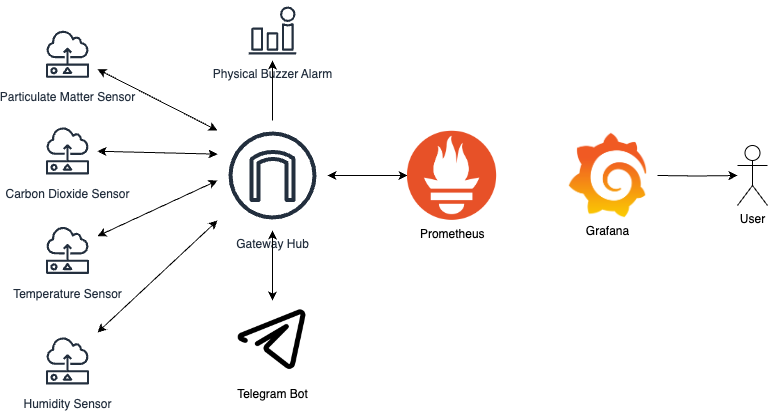

# Air Quality Sensor

## Overview

Sleep is integral to maintaining good health and overall well-being throughout one's lifespan. Our team has found out that the quality of one’s waking hours is influenced to a considerable extent by the events that occur during your slumber. As such, our team has decided to focus on the environmental factors that can cause one’s sleep quality to deteriorate. We have decided to develop an advanced air quality monitoring system with sensors capable of accurately measuring and monitoring temperature, humidity, carbon dioxide concentration and particulate matter.

Our solution aims to provide data visualization through a user-friendly web interface while also implementing an alert system to promptly notify users when air quality reaches dangerous levels. In addition, a telgram bot to enable the remote supervision and regulation of diverse environmental measurements. The project seeks to address the need for precise air quality information for various applications, ranging from daily planning to environmental monitoring and safety measures.

## Architecture

[Architecture](images/Architecture.png)


## Sensor used

- Particulate Matter Sensor
  - PM sensors provide real-time data on the concentration of particulate matter in the air, helping users assess air quality and potential health risks. They are essential for monitoring air pollution levels, especially in urban areas.
- Carbon Dioxide Sensor
  - CO2 sensors are vital for assessing indoor air quality. High CO2 levels can indicate poor ventilation, which can lead to discomfort and decreased cognitive performance. These sensors help maintain healthy indoor environments and optimize energy efficiency in buildings.
- Temperature Sensor
  - Temperature sensors provide data on the current temperature, which is crucial for comfort, safety, and energy efficiency. In air quality monitoring, temperature data can be used to assess thermal comfort and to calculate the heat index.
- Humidity Sensor
  - Humidity sensors are essential for assessing indoor comfort and air quality. Maintaining the right humidity levels can prevent mold growth, ensure comfort, and improve air quality.

## Grafana dashboard

- Highly customisable
- Data visualised as line charts

## Telegram Bot

A telegram bot built to facilitate remote monitoring and control of various environmental measurements, specifically focusing on air quality metrics. It allows users to access real-time data and take action by remotely toggling the buzzer or alarm system on and off. The bot is especially useful for scenarios where monitoring air quality and safety are critical, such as in smart homes.

### Key Features

#### Air Quality Readings

- Particulate Matter (PM2.5) levels
- Carbon Dioxide (CO2) concentration in parts per million (ppm)
- Temperature in degrees Celsius
- Relative Humidity in percentage
- Heat Index for temperature perception
- WiFi Signal Strength (RSSI) for sensor connectivity

#### Remote Control

Users can interact with MeasurementBot through Telegram to:

- Turn on the alarm or buzzer system to alert them in case of poor air quality.
- Turn off the alarm or buzzer system when the situation is resolved or deemed safe.

#### Alerts and Notifications

- The bot can send alerts and notifications to users when air quality measurements exceed predefined thresholds. For example, if PM2.5 levels rise above a specified limit, the bot can notify the user and sound the alarm.

#### User-Friendly Interface

Telegram bot offers an intuitive and user-friendly interface with command buttons, inline keyboards, and text-based interactions for easy access to air quality data and control features.

## Deployment

```bash
cd gateway
sudo docker compose build
sudo docker compose up -d
```
